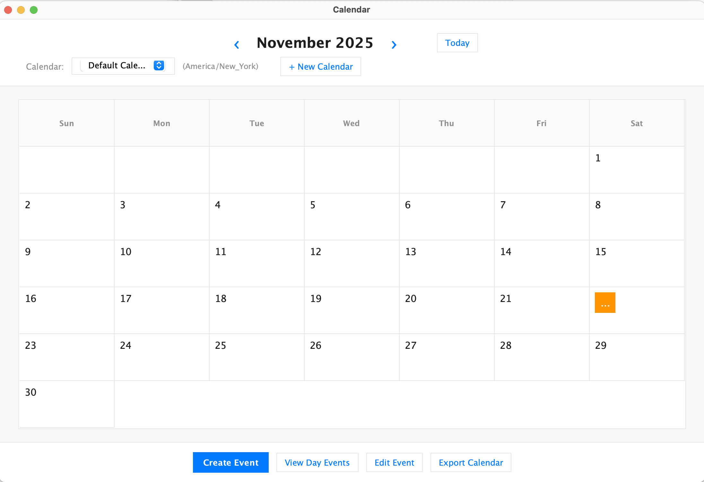

# Calendar App

A multi-calendar event management application built in Java with both a Swing GUI and a text-based CLI. Supports multiple calendars with timezone awareness, single and recurring events, event editing at different scopes, CSV/ICS export, and an analytics dashboard.

## Features

- **Multi-Calendar Support** — Create and manage multiple calendars, each with its own IANA timezone
- **Event Management** — Create single, all-day, and recurring events with customizable repeat patterns (by weekday, for N occurrences, or until a date)
- **Event Editing** — Edit a single event, all future events in a series, or an entire series at once
- **Cross-Calendar Copying** — Copy individual events, a day's events, or a date range between calendars with automatic timezone conversion
- **Export** — Export any calendar to CSV or ICS format
- **Analytics Dashboard** — View metrics for a selected date range including total events, events by subject/weekday/week/month, busiest and least busy days, average events per day, and online vs. offline event breakdown
- **Three Modes** — Interactive CLI, headless (script file), and a graphical Swing GUI with a month view, clickable day cells, and dialog-based workflows

## Architecture

The application follows the **Model-View-Controller (MVC)** pattern:

- **Model** — `CalendarEvent`, `CalendarModelImpl`, `MultiCalendarModelImpl`, `CalendarAnalytics`, `EventFactory`
- **View** — `ConsoleView` (text), `CalendarGui` (Swing GUI), `EventDialogFactory`
- **Controller** — `CalendarController` (text modes), `GuiController` (GUI mode)

## Prerequisites

- Java 11+
- Gradle 8+ (or use the included Gradle wrapper)

## Getting Started

1. **Clone the repository**
   ```bash
   git clone https://github.com/<your-username>/calendar-app.git
   cd calendar-app
   ```

2. **Build the project**
   ```bash
   ./gradlew build
   ```

3. **Run the application**

   **GUI mode** (default):
   ```bash
   ./gradlew run
   ```
   Or with the JAR:
   ```bash
   ./gradlew jar
   java -jar build/libs/calendar-1.0.jar
   ```

   **Interactive mode**:
   ```bash
   java -jar build/libs/calendar-1.0.jar --mode interactive
   ```

   **Headless mode** (run a script file):
   ```bash
   java -jar build/libs/calendar-1.0.jar --mode headless path/to/commands.txt
   ```

4. **Run tests**
   ```bash
   ./gradlew test
   ```
   Coverage reports are generated at `build/reports/jacoco/test/html/index.html`.

## GUI Overview

<p align="center">
  
</p>

- **Top panel** — Month navigation and calendar selection/creation
- **Center** — Month grid with clickable day cells and event indicators
- **Bottom panel** — Buttons for creating events, viewing day events, editing events, analytics dashboard, and exporting

## Text Commands

Once a calendar is selected with `use calendar --name <name>`, available commands include:

| Command | Description |
|---|---|
| `create calendar --name <name> --timezone <tz>` | Create a new calendar |
| `use calendar --name <name>` | Set the active calendar |
| `create event <subject> from <start> to <end>` | Create a single event |
| `create event <subject> on <date>` | Create an all-day event |
| `edit event <prop> <subject> from <start> to <end> with <value>` | Edit a single event |
| `print events on <date>` | View events on a date |
| `print events from <start> to <end>` | View events in a range |
| `show status on <datetime>` | Check busy/available status |
| `show calendar dashboard from <date> to <date>` | Analytics dashboard |
| `export cal <filename.csv\|.ics>` | Export calendar |
| `exit` | Quit the program |

See `res/commands.txt` for a full list of valid commands.

## Project Structure

```
calendar-app/
├── build.gradle
├── settings.gradle
├── gradlew / gradlew.bat
├── config/checkstyle/          # Checkstyle rules
├── res/                        # Screenshots, sample commands
│   └── scheenshotsGUI/         # GUI screenshots
└── src/
    ├── main/java/
    │   ├── CalendarRunner.java          # Entry point
    │   ├── controller/                  # Controllers (text + GUI)
    │   ├── model/                       # Data models & analytics
    │   └── view/                        # Console view & Swing GUI
    └── test/java/                       # JUnit test suite
        ├── controller/
        ├── model/
        └── view/
```
